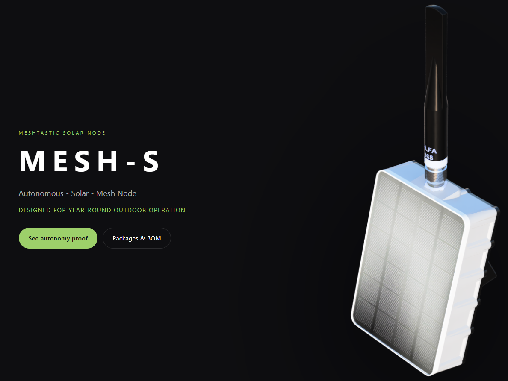

# Mesh-S — Solar Meshtastic Node

Mesh-S is the project site for a solar-powered Meshtastic node, focused on reliable outdoor operation and autonomous power.
It documents the hardware concept, enclosure approach, and real-world usage considerations.

The project is intended for the Meshtastic / LoRa / outdoor / maker community.
It emphasizes autonomous operation, solar power, and a purpose-built enclosure with practical field constraints in mind.

## Preview / Demo

🌐 Live site: https://mesh-s.org

## Key Features

- Solar-powered Meshtastic node
- Outdoor ASA enclosure
- Battery autonomy monitoring
- Real-world humidity & temperature tests
- Custom mounting system
- Open hardware / open documentation

## Screenshots / Visuals

<!-- Add real screenshots when available. -->

## Technologies

- HTML / CSS
- Meshtastic
- LoRa 868 MHz
- Solar power
- 3D-printed ASA enclosure

## Project Status

🚧 Project status: Active development

## Author

👤 Author: @skrap87  
📡 Telegram: @skrap87

## License

License: MIT
